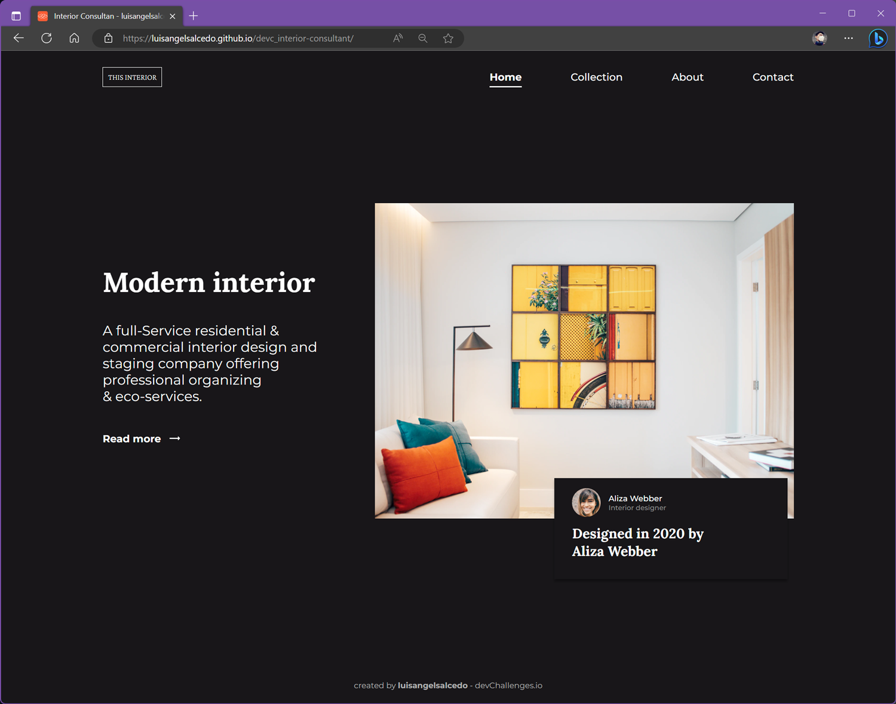

<h1 align="center">Interior Consultant</h1>

   Solution for a challenge from  <a href="http://devchallenges.io" target="_blank">Devchallenges.io</a>.

  <h3>
    <a href="https://luisangelsalcedo.github.io/devc_interior-consultant" target="_blank">
      Demo
    </a>
     | 
    <a href="https://github.com/luisangelsalcedo/devc_interior-consultant">
      Solution
    </a>
     | 
    <a href="https://devchallenges.io/challenges/Jymh2b2FyebRTUljkNcb">
      Challenge
    </a>
  </h3>

## Overview

## Built With

<!-- This section should list any major frameworks that you built your project using. Here are a few examples.-->

- [Sass](https://sass-lang.com/)
- [JavaScript](https://developer.mozilla.org/es/docs/Web/JavaScript)
